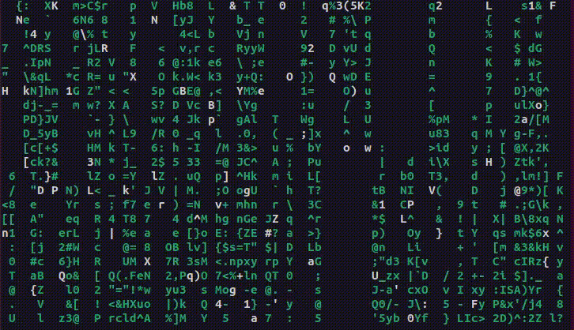
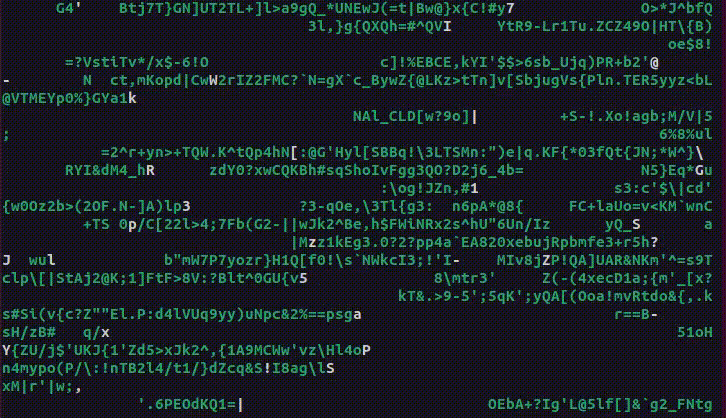

# Matrix Rain
scala version of https://github.com/nojvek/matrix-rain

## Usage
```
sbt run
```
or
```
sbt assembly
java -jar target/scala-3.1.3/matrix-rain-assembly-0.5.jar [-d {h,v}]
                                                          [-c {green, red, blue, yellow, magenta, cyan, white}]
                                                          [-k {ascii, binary, braille, emoji, katakana}] 
        
The famous Matrix rain effect of falling green characters as a cli command

Optional arguments:
  -h, --help               Show this help message and exit
  -d, --direction <value>  {h, v}
                           Change direction of rain. h=horizontal, v=vertical
  -c, --color <value>      {green, red, blue, yellow, magenta, cyan, white}
                           Rain color. NOTE: droplet start is always white
  -k, --char-range <value>
                           {ascii, binary, braille, emoji, katakana}
                           Use rain characters from char-range
  -m, --mask-path <value>  Use the specified image to build a mask for the raindrops.
  -i, --invert-mask        Invert the mask specified with --mask-path.
  --offset-row <value>     Move the upper left corner of the mask down n rows.
  --offset-col <value>     Move the upper left corner of the mask right n columns.
  --font-ratio <value>     Ratio between character height over width in the terminal.
  --print-mask             Print mask and exit.
```

## Screenshots



